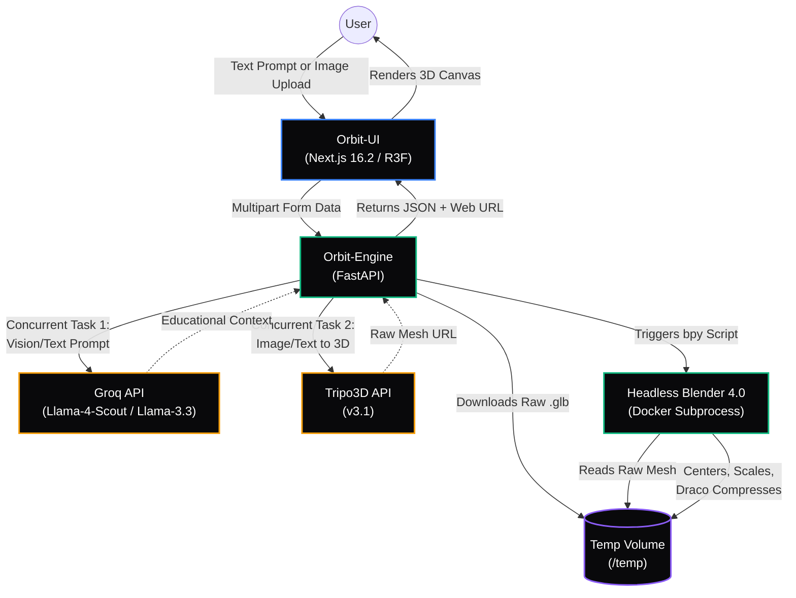

# **Orbit-3D: Technical Architecture & Design**

This document serves as the technical blueprint for the **Orbit-3D** prototype, outlining the system design, AI logic, engineering challenges, and roadmap for enterprise scaling within NexEra's training modules.

## **1. System Architecture & AI Logic**

The pipeline follows a decoupled **"Generator & Optimizer"** architecture. Instead of burdening the client device with heavy 3D math, the system pushes generation and mathematical optimization entirely to a Linux cloud container.

### **Architectural Visual Flow**

### **Architectural Step-by-Step**

1. **Learner Interaction:** User submits a text prompt or image via the Next.js **Orbit-UI**.  
2. **FastAPI Orchestrator:** The backend initiates two concurrent asynchronous tasks:  
   * **Task A (Groq):** Llama-4-Scout Vision processes the image/text to generate educational JSON context.  
   * **Task B (Tripo3D):** Multimodal API generates the raw 3D mesh URL.  
3. **Optimization Pipeline:** The backend downloads the raw mesh to a temporary volume mount.  
4. **Headless Blender:** A Python bpy subprocess centers the geometry bounds and scales the model to exactly 1 unit.  
5. **Delivery:** The UI receives the JSON metadata and the optimized .glb URL for real-time WebGL rendering via **React Three Fiber**.

### **The AI Logic ("Concurrent Multimodal Pipeline")**

Waiting for 3D generation sequentially is heavily detrimental to UX. The backend solves this by detaching generation from contextualization.

* **Image Encoding:** Uploaded physical images are converted to Base64 byte-strings to securely pass through Groq's Vision endpoints without requiring public hosting.  
* **Concurrent Execution:** Using asyncio.gather(), the system forces the LLM to deduce the historical context at the exact same time Tripo3D is sculpting the mesh. The LLM finishes in about 800 ms and waits idly for the 3D mesh to complete, adding 0 seconds to the user's total wait time.

## **2. Engineering Challenges & Solutions**

### **A. Draco Compression and the Browser Decoder**

* **Challenge:** The Blender script compresses each .glb with Google Draco. That shrinks the download, but the browser has to fetch and run a WebAssembly (WASM) decoder to unpack it, and on certain misaligned AI meshes that decoder caused a 4GB RAM spike that crashed the Chrome tab.  
* **Current state:** The pipeline still exports with Draco enabled (`export_draco_mesh_compression_level=6` in `blender/optimize.py`), favouring payload size.  
* **Next step:** Validate each optimized mesh and fall back to an uncompressed export when it fails, so tab stability never depends on the decoder.

### **B. Next.js 16 WebGL SSR Collision**

* **Challenge:** Next.js Server-Side Rendering (SSR) attempts to render the 3D Canvas in a Node.js environment lacking the window object.  
* **Solution:** Bypassed Turbopack SSR limitations by implementing explicit **Dynamic Named Exports**:  
  dynamic(() => import('../components/ThreeViewer').then((mod) => mod.ThreeViewer), { ssr: false }).

### **C. OS-Level Blender Dependency & OOMKills**

* **Challenge:** The Python bpy module requires deep Linux C++ libraries (libgl1, libxrender1). Furthermore, running Blender on restrictive Cloud Free Tiers (like Render's 512MB RAM) caused Out-of-Memory (OOM) Container Assassinations.  
* **Solution:** Containerized the backend in a single Docker image (python:3.11-slim, the official Blender 4.0.2 build, and its GL libraries) to guarantee library parity, and moved it to a Hugging Face Space with 16GB RAM so Headless Blender runs without OOM kills.

### **D. Third-Party API Micro-Outages**

* **Challenge:** The polling loop to Tripo3D (up to 100 checks, 3 seconds apart) would instantly crash if the external server returned a single 502 Bad Gateway HTML page during a micro-hiccup.  
* **Solution:** Implemented transient error handling in the asyncio loop. If the external API returns an error or drops the connection, the script logs the hiccup and retries 3 seconds later without destroying the user's session.

## **3. Scaling Roadmap**

1. **Decoupled Task Queues:** Separate the FastAPI router from the Blender optimization layer using Celery and Redis. This allows a fleet of auto-scaling worker nodes to handle heavy 3D math without blocking the primary HTTP API.  
2. **WebSocket Real-Time Progress:** Move from synchronous HTTP polling to WebSockets to stream granular progress updates (e.g., "Sculpting...", "Downloading...", "Baking Textures...") directly to the Next.js UI.  
3. **AI-Driven Texture Baking:** Implement a secondary AI pass (e.g., Stable Diffusion ControlNet) directly into the Blender pipeline to bake high-fidelity 4K PBR textures onto the low-poly AI meshes.